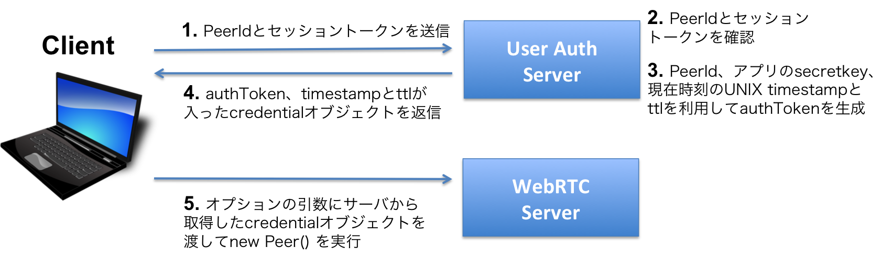

[English version of this document](./README.md)

# SkyWay Peer 認証サンプル

このリポジトリには、Peerを認証するためのクレデンシャルを生成するサンプルがあります。

## 全体の認証フロー



1. クライアントのpeerIdとセッショントークン、またはパスワードを自前の認証サーバに送信する
2. ユーザ側の認証基盤でセッショントークンやパスワードにて認証を行う
3. [authToken](#authtoken)で定義された方法でauthTokenを生成する
4. （authToken、timestamp、ttlが含まれてる）credentialオブジェクトをクライアントに返信する
5. [例：JavaScriptとjQueryを利用したリクエスト](#例javascriptとjqueryを利用したリクエスト)のように `new Peer()`のオプション引数に認証サーバから取得したcredentialを渡してSkyWayのサーバに接続する

**※注意: new Peer() を実行する際は、毎回1〜5の手順を実施し、authTokenを更新して下さい。** ネットワークの切断等で前のセッションがきれいに終了せず残っている場合、一定期間、同じPeerIdとauthTokenの組み合わせで再接続することが出来ません。authTokenを更新すればすぐに再接続が可能です。**

## クレデンシャルの形式

`new Peer()` の `option` 引数に入る `credential` は下記の形式のJavaScriptオブジェクトです。

```javascript
{
  authToken: <string>,
  ttl: <number>,
  timestamp: <number>
}
```

### ttl

`ttl` はクレデンシャルの有効期限です。
有効期限が切れた場合、SkyWayサーバへの接続が切断されます。
`ttl` の単位は秒で、600（10分）から90000（25時間）の間で設定してください。

### timestamp

`timestamp` は現在時刻のUnixタイムスタンプ（秒）です。

**注: 未来の時刻のタイムスタンプは拒否される。**

### authToken

`peerId`、`timestamp`、`ttl`とAppの`secretKey`を利用して計算される`peerId`用の認証トークンです。
`secretKey`は開発者ダッシュボードのApp画面から取得できます。

`$timestamp:$ttl:$peerId`の文字列にAppの`secretKey`を秘密鍵として利用して、HMAC-SHA256 アルゴリズムを利用して計算します。

計算されたハッシュはBase64形式である必要があります。


## サンプルの利用方法

サンプルサーバの動作手順は各言語の名前のフォルダーに入っているREADMEに記載されています。

サンプルを実行する前に、`Config section`に入ってる`secretKey`変数を開発者ダッシュボードから取得した値に変更する必要があります。

クライアントからサーバに渡されるユーザIDとセッショントークンが有効か確認するために`checkSessionToken()`または`check_session_token()`関数の実装も可能です。
サンプルではこの機能は実装されておらず、常に有効なトークンと判断されます。
ササンプルではセッショントークンを確認していますが、他にパスワードなどの任意な認証手段も利用できます。

サンプルサーバが起動したら http://localhost:8080/authenticate 宛てに`POST`リクエストを投げます。

リクエストは`application/x-www-form-urlencoded`形式で`peerId`と`sessionToken`パラメータを設定する必要があります。

下記の[例：JavaScriptとjQueryを利用したリクエスト](#例javascriptとjqueryを利用したリクエスト)を参照してください。
または[クライアントスクリプトのサンプル](#クライアントスクリプトのサンプル)に記載されてる手順に沿って、クライアントアプリのサンプルを利用してください。

### 例：JavaScriptとjQueryを利用したリクエスト

```javascript
$.post('http://localhost:8080/authenticate',
  {
    peerId: 'TestPeerID',
    sessionToken: '4CXS0f19nvMJBYK05o3toTWtZF5Lfd2t6Ikr2lID'
  }, function(credential) {
    var peer = new Peer('TestPeerID', {
      apikey: apikey,
      credential: credential
    });
    
    peer.on('open', function() {
      // ...
    });
  }).fail(function() {
    alert('Peer Authentication Failed');
  });
```

### クライアントスクリプトのサンプル

HTML/JavaScriptのクライアント認証サンプルが`client/`フォルダーに入ってます。

下記のコマンドを利用して、クライアントファイルをアクセス可能にします。
```bash
$ cd client
$ python -m SimpleHTTPServer 8000
```

いずれかのサンプルサーバが動作している状態で、http://localhost:8000 にアクセスして、`Get Credential`を押すと認証クレデンシャルが取得されます。
